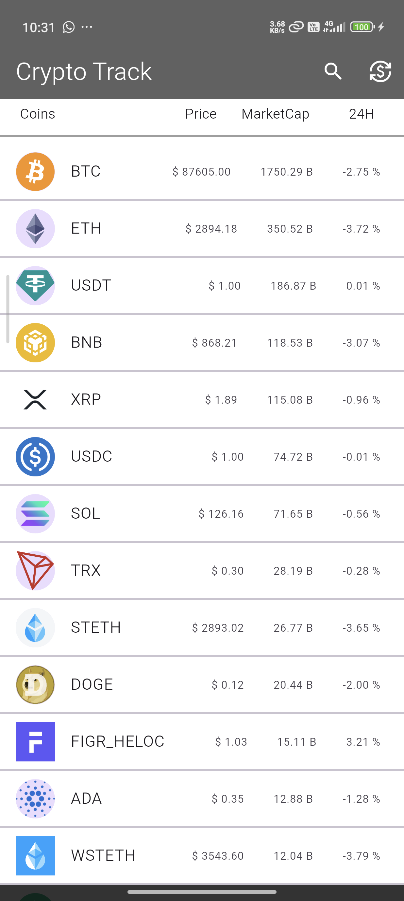
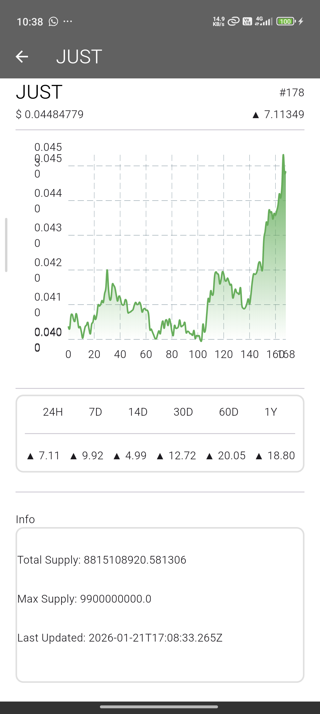
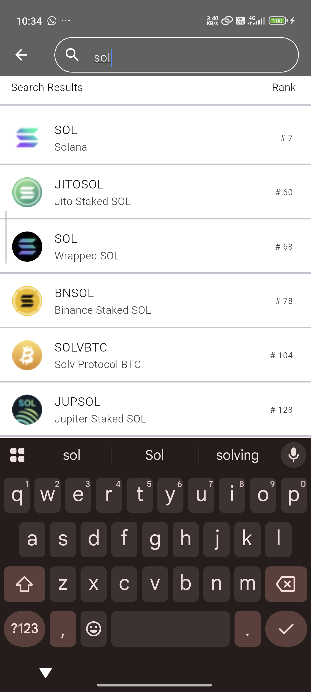
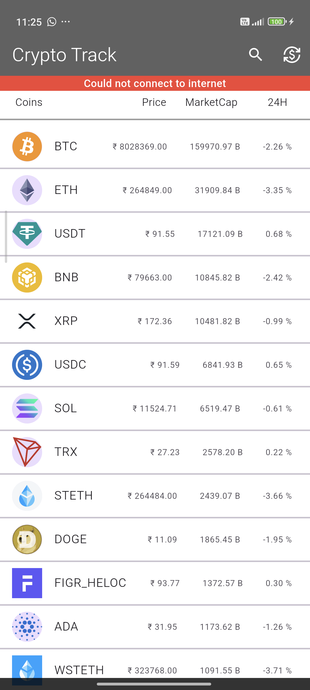

# CryptoTrack

### Features:
- Currency toggle support changing currency between inr/usd.
- Search bar for searching the required coin.
- Price history graph for visualing market trends.
- Infinite scrolling list (Pagination).
- Pull to refresh for getting most recent data.
- Permanent offline message at top when user is offline.
- Blocked api calls ,currency change, pagination and pull to refresh when user is offline to preserve the pre-fetched data.

### My Developement Journey:  
Firstly I obtained my coingecko demo api key.  
Then I created home page ui for showing all coins list.   
Then I written bloc logic, repository and api request codes.   
I implemented Pagination and then added pull to refresh.    
After that I created coin details page with price history graph(using fl_chart)  
and completed the bloc, models, repository etc logic.  
Then I created a bloc for changing the currency, and connected it to other  
blocs via inter-bloc communication.  
Similarly created the bloc for providing online/offline states into other blocs and block api calls.  
Added connectivity banner to all pages.  
Then I added one more page for searching the coins based on query and completed its bloc, repo and api logic.  

 
## Screenshots:

### Home Page:

### Coin Details Page:

### Search Page:

### Offline Banner:

### Demo Video:
[Click Here](https://drive.google.com/drive/folders/1-DLTTP32MHJkxe5TJ7g4E1qV0vOZFsPD?usp=sharing)
